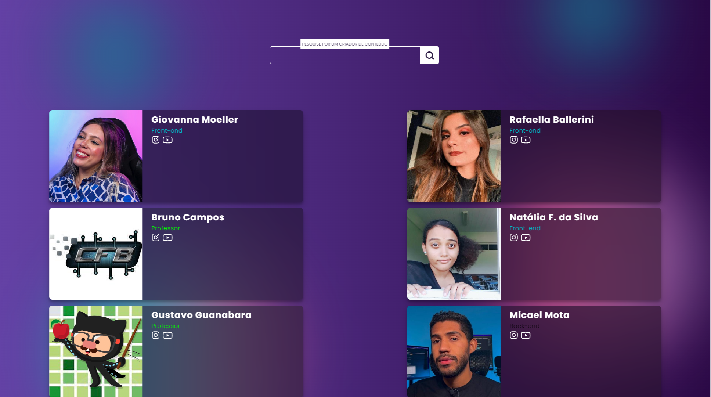

<h1>API Criadores de Conteudo</h1>

Conheça o meu primeiro projeto Full-stack!

O backend deste projeto foi desenvolvido com NodeJs, Postgres e Sequelize.
  
O Front-end é desenvolvido com ReactJs.
  

Para rodar o projeto localmente siga os seguintes passos

<ul>
  <li>
    git clone https://github.com/Marcelo1080p/API_criador_conteudo
  </li>
  <li>
    vá atá o diretório do projeto e execute o seguinte comando: "npm install" ou "npm i", para baixar as dependências do projeto
  </li>
  <li>
    navegue até a pasta backend e frontend para rodar o projeto:  
    comandos: backend - 1) cd backend, 2) nodemon scr/index.js.  
    comandos: frontend - 1) cd frontend, 2) npm run dev. 
  </li>
<ul/>

Para adicionar os seus criadores de conteúdos favoritos você pode usar o <strong>Postman</strong>
 
No <strong>Postman<strong>, crie uma request <strong>Post</strong>  
  a rota para usar na url é: http://localhost:3001/criador;  
  os dados necessários para passar no body são: { "
      "nome": "Nome do Criador", 
    "tipoDev": "Se é front/back/fullstack", 
    "imgLink": "link da img, ex: https://github.com/Marcelo1080p.png",  
     "insta": "Link do insta do criador", 
     "youTube: "Link do canal do criador", 
  "}

     
  
<h2>Visual do front-end</h2> 
  
  

 
<h4>Você poderá encontrar o seu criador favorito pesquisando pelo nome!</h4>
